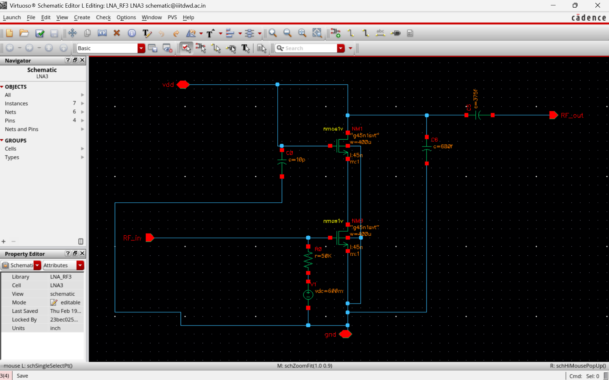

# Low Noise Amplifier (LNA) Design using Cadence Virtuoso

This project presents the design and RF simulation of a **Low Noise Amplifier (LNA)** implemented at the transistor level using **Cadence Virtuoso**.  
The LNA is a critical block in RF receiver front-ends, responsible for amplifying weak incoming signals while introducing minimal noise.

The design focuses on evaluating key RF performance metrics including **gain, noise figure, and S-parameters** across a wide frequency range.

---

## Project Overview

Low Noise Amplifiers are widely used in wireless communication systems such as:

- RF receivers
- Wireless communication systems
- Radar systems
- Satellite communication
- IoT RF front-end circuits

The goal of this project is to design and analyze an LNA circuit and evaluate its performance using RF simulation techniques.

---

## Design Specifications

| Parameter | Value |
|----------|-------|
| Technology | CMOS |
| Design Tool | Cadence Virtuoso |
| Supply Voltage (VDD) | 0.8 V |
| Simulation Type | S-Parameter & Noise Analysis |

---

## Circuit Design

The LNA was designed at the transistor level using MOSFET devices and biasing networks.  
The circuit includes:

- Input RF signal port
- Transistor amplification stage
- Biasing network
- Output coupling network

### LNA Schematic

---

## Testbench Setup

A testbench was created to evaluate the RF performance of the LNA using:

- RF input and output ports
- Biasing voltage sources
- Ground reference

### Testbench Circuit

---

## Simulation Results

### Gain Response (Available Gain)

The available gain was evaluated across the RF frequency range.

Peak gain occurs around **1.56 GHz**.

---

### Noise Figure

Noise analysis was performed to evaluate how much noise the amplifier introduces to the signal.

---

### S-Parameter Analysis

S-parameters were used to analyze the RF performance of the amplifier.

#### S11 and S21 Response

#### S12 and S22 Response

---

## Key Performance Results

The LNA performance was evaluated using RF simulations over a frequency range of **0.5 GHz – 10 GHz**.

| Parameter | Result |
|----------|-------|
| Peak Available Gain (GA) | **18.91 dB** |
| Frequency at Peak Gain | **1.56 GHz** |
| Minimum Noise Figure (NF) | **2.3 dB** |
| Input Return Loss (S11) | **-5.9 dB** |
| Output Return Loss (S22) | **-7.8 dB** |
| Reverse Isolation (S12) | **-48 dB** |

---

## Tools Used

- Cadence Virtuoso
- RF Simulation Environment
- S-Parameter Analysis
- Noise Analysis

---

## Learning Outcomes

Through this project, the following concepts were explored:

- RF circuit design fundamentals
- LNA architecture and operation
- S-parameter analysis
- Noise figure analysis
- Cadence Virtuoso schematic design
- RF simulation workflows

---

